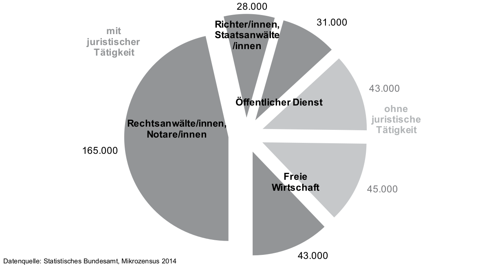

# Konzeptualisierung {#sec:concept}

**Lawly^[Arbeitstitel] gibt Juristen moderne Mittel an die Hand.**

In diesem Kapitel wird der Zustand des Marktes allgemein für Software-Dienstleistungen für Juristen[^gender] und im speziellen für ein digitales Konkurrenzprodukt zu klassischen Gesetzbüchern analysiert. ^[>\color{red}Alles Abschnitte oder Kapitel mit Abschnitten?] 
^[>\color{red}Vielleicht doch lieber überall die Gender-Formulierungen verwenden? Was ist heutzutage eher angebracht? Das hier scheint das Problem nur zu umgehen.] @sec:digitalrevolution geht dabei auf den sich im Rechtswesen generell anbahnenden digitalen Umschwung und die sich dadurch ergebende Chance und Notwendigkeit für moderne Softwarelösungen ein. Anschließend beschäftigt sich @sec:market mit dem konkreten traditionellen Markt für Gesetzestexte und -kommentare, bevor in @sec:saas der aktuelle Zustand des digitalen Marktes für rechtliche Dienstleistungen ^[>\color{red}Nur Gesetzestexte?] und die in ihm bereits etablierten und aktuell aufkommenden Konkurrenzprodukte betrachtet werden. Zum Abschluss dieses Kapitels wird zu guter Letzt in @sec:goal die Zielsetzung für eine neue digitale Dienstleistung in diesem Bereich dargelegt und der Rahmen des als Teil dieser Arbeit entstandene Softwareprojektes konkretisiert.

^[>\color{red}Beispiele für Lawtec Firmen in den USA - maybe?]

[^gender]: Hinweis zu Gender-Formulierungen: Bei allen Bezeichnungen von Personengruppen meint, wenn nicht explizit anders angemerkt, die gewählte Formulierung beide Geschlechter.

## Die digitale Revolution des Rechtswesens {#sec:digitalrevolution}
Für den sich anbahnenden Paradigmenwechsel hin zu einer verstärkt digitalen Arbeitsweise im Rechtswesen gibt es viele Anhaltspunkte. Im folgenden werden dies bezüglich exemplarisch Vorstöße von drei unterschiedlichen Akteuren in die Richtung einer elektronische Kommunikation aufgeführt: Von Seiten des Gesetzgebers, der \ac{BRAK} und einer global agierenden Kanzlei. ^[>\color{red}Kanzlei.. Aufführen oder nicht?]

Die deutsche Bundesregierung hat im letzten Jahrzehnt verstärkt gezeigt, dass ein Interesse daran besteht, dass moderne digitale Werkzeuge im Rechtswesen Einzug halten. Dies wird einerseits durch Gesetzesänderungen, welche den Einsatz digitaler Hilfsmittel dort legalisiert wo er zuvor noch undenkbar war und anderseits durch den Versuch, die Realisierung von geeigneten Softwarelösungen durch neue Gesetze zu erzwingen klar. ^[>\color{red}Komische Satzstruktur?]

Ein Beispiel hierfür ist unter anderem die Kommunikation im Rechtsverkehr zwischen Kanzleien und Gerichten: Bereits seit 2001 besteht das *Zustellungsreformgesetz* [@BGBL_2001_ZustRG] und seit 2005 das *Justizkommunikationsgesetz* [@BGBL_2005_JKmG]. Ersteres legte bereits sehr früh den Grundstein für kleinere Pilotprojekte an einzelnen Gerichten. Das Justizkommunikationsgesetz hingegen sollte diese für die breite Masse an Juristen verfügbar machen. Durch die einerseits hohe Anforderungen an Datenschutz und Privatsphäre sowie die Notwendigkeit der Rechtsverbindlichkeit (z.B. durch digitale Signaturen) und den anderseits fehlenden bundesweiten Standard und die daraus resultierende hohe Einstiegshürde für potentielle Nutzer hielt sich die Adoptionsrate stark in Grenzen ^[citation needed].

Um dem Entgegen zu wirken wurde ab 2004 von Bundesverwaltungsgericht und dem Bundesamt für Sicherheit in der Informationstechnik das \ac{EGVP} entwickelt. Dieses sollte auf Grundlage der neuen rechtlichen Möglichkeiten erstmals einen Standard schaffen, welcher die digitale Rechtskommunikation einer breiteren Masse zur Verfügung stellt. Auch hier führten allerdings rechtliche Hindernisse wie die Notwendigkeit einer vorhergehenden individuellen Registrierung der Gerichte für das Verfahren und auch die Art der Implementierung zu Problemen. Obwohl das \ac{EGVP} als eine Art Standard für rechtlichen Kommunikation geplant war, orientiert es sich selbst nicht an technologischen Standards sondern setzte auf proprietäre Software und zeigte starke Mängel in Bezug auf Anwenderfreundlichkeit [@10PunkteAkzeptanz].

Erst 2013 folgte mit dem *Gesetz zur Förderung des elektronischen Rechtsverkehrs mit den Gerichten* [@BGBL_2013_FördElRV] der nächste Vorstoß: Der Gesetzgeber verpflichtete hierin die \ac{BRAK} zur Einrichtung eines sogenannten *besonderem elektronischem Anwaltspostfaches* <!-- (\acsu{beA}) -->für jeden in Deutschland zugelassenen Rechtsanwalt. Das \ac{beA} soll im großen und ganzen nichts anderes zur Verfügung stellen als verschlüsselte E-Mail-Kommunikation zwischen Kanzleien und Gerichten. Geplagt von Problemen wurde das gesetzlich festgelegte Ziel die Plattform bis zum 01.01.2016 fertig zu stellen wegen "nicht ausreichender Qualität" der Software zuerst verfehlt [@BRAK_beAkommtSpaeter] und dann, kurz vor der scheinbar erfolgreichen Fertigstellung im zweiten Anlauf 10 Monate später [@BRAK_beAStart], durch ein einstweiliges Verfahren erneut gestoppt: Zwei Rechtsanwälte hatten beantragt, dass ihr \ac{beA} nur mit ihrer ausdrücklichen Zustimmung freigeschaltet werde. Laut \ac{BRAK} ist diese individuelle Freischaltung allerdings technisch nicht möglich, womit sich das \ac{beA} weiter verzögert [@BRAK_beAVerfahren].

Nun ist das \ac{beA} nicht unproblematisch in seiner Umsetzung, es zeigt allerdings eine andere Seite: Das Interesse an der Umsetzung des \ac{beA}s geht klar von der \ac{BRAK} und damit den Rechtsanwälten aus. Schon vor dem Beginn der Entwicklung des Postfaches bemühte sich die \ac{BRAK} um eine Stärkung der Akzeptanz des elektronisch Rechtsverkehr -- mit vielversprechenden Hinweisen auf die Zielsetzung des Postfaches als eine Benutzerfreundliche an bereits etablierten Standards orientierte Plattform [@BRAK2008_Akzeptanz]. Diese Forderungen galten zu Beginn noch einer Weiterentwicklung des \ac{EGVP}, resultierten Endgültig aber in der Entwicklung des \ac{beA}.

Ein dritter Akteur der eine wichtige Rolle bei einem solchen Paradigmenwechsel hin zu einer elektronischen Kommunikation im Rechtswesen spielt sind die Kanzleien. Wobei sie auch ein immenses wirtschaftliches Interesse an einer breiten Verfügbarkeit des elektronischen Rechtsverkehrs haben, sind sie an seiner Realisierung primär durch die \ac{BRAK} beteiligt. Kanzlei-intern hingegen kann die digitale Kommunikation von ihnen selbstständig umgesetzt werde. Aus Unterhaltungen mit Rechtsanwälten einer weltweit agierenden Großkanzlei hat sich ergeben, dass der Einsatz moderner Hilfsmittel zur Kommunikation bei vielen Kanzleien nicht bei E-Mails stehen geblieben ist. Vielfach wird auch schon, ähnlich zu modernen Technologieunternehmen, auf erst in den letzten Jahren aufgekommene Kommunikationsplattformen wie *Slack* gesetzt. Dies deutet auf einen immensen Innovationswillen hin, solange die Innovation mit einer Effizienzsteigerung einhergeht. ^[>\color{red}Kanzlei und Anwalt namentlich benennen mit Zitat?]

## Gesetzbücher und -kommentare {#sec:market}
Neben der weiterhin fast ausschließlich Papier-gestützten rechtlichen Kommunikation stechen besonders die *roten Bücher*, offiziell *Schönfelder -- Deutsche Gesetze*, des Beck Verlages ins Auge: ^[>So schwer, dass es in einer Version mit ausklappbarem Aufsteller verkauft wird.] Mit seinen fast 2,5 Kilogramm Masse gilt es als das Standardwerk des deutschen Rechtswesens. Da das deutsche Recht kein stehendes Konstrukt ist, sondern laufend Änderungen unterliegt, erscheinen drei bis vier mal im Jahr sogenannte *Ergänzungslieferungen*: Nach dem kostenpflichtigen Erwerb gilt es, diese in das als Loseblattsammlung konzipierte Ursprungswerk in Kleinstarbeit manuell einzusortieren. Und dabei ist der Schönfelder nur eines von vielen ähnlich umfassenden und aktuell zu haltenden Werken. Auf Grund der Notwendigkeit dieser regelmäßigen Aktualisierung bewirbt der Beck Verlag die von ihm vertriebenen Gesetzessammlungen primär in Kombination mit Abonnements des hauseigenen *Aktualisierungsservices*. [^schoenfeldershop]. Zu Marketingzwecken empfiehlt der Verlag angehenden Juristen mit dieser und ähnlichen Gesetzessammlungen "einen Bund fürs Leben zu schließen [...] ^[>Zitat gekürzt, weil zu abstrus. Wirklich.] und die Beziehung als Freundschaft mittels Kommunikation und Interesse aufrecht und lebendig zu gestalten" [^buecherliebe].

Die Zielgruppe für diesen Kassenschlager ist schlichtweg jeder, der mit dem Rechtswesen zu tun hat: Das bundesweit ca. 165.000 aktiven Rechtsanwälte [@BRAK_Mitglieder_2015], über 25.000 Richter und Staatsanwälte im öffentlichen Dienst [@BFJ_ZahlRichterStaatsanwaelte] und über 70.000 weitere Juristen, welche anderweitige juristische Tätigkeiten im öffentlichen Dienst und der freien Wirtschaft ausüben (vrgl. Abbildung @fig:juristischeberufe aus @BFA_2012_Chancen, Seite 76). Außerdem gibt es aktuell über 100.000 Jura-Studenten [@Wissenschaftsrat2012, Seite 80]. In all diesen Bereichen ist die Tendenz weiterhin steigend [@BFA_2012_Chancen, Seite 75-78].

{#fig:juristischeberufe}

Beispielhaft ergeben sich aus diesen Zahlen alleine durch die von Land und Bund beschäftigten Richter und Anwälte jährliche Kosten von über 1 Millionen Euro für den öffentlichen Dienst. Dabei ist wichtig zu bemerken, dass die für diese Schätzung angenommenen Werte, pro Jurist eine Gesetzessammlung mit je drei Ergänzungslieferungen pro Jahr zu je 15€, niedrig angesetzt sind.[^ergaenzungshop] Ausübende Juristen sind meist auf drei oder mehr solcher Werke angewiesen.

Da die eigentlichen Normen eines Gesetzes, um möglichst viele Alltagssituationen abzudecken, meist abstrakt gehalten sind, ist ihre Auslegung für Juristen oft schwierig. Um diesem Problem entgegen zu wirken haben sich bereits früh sogenannte Gesetzeskommentare etabliert und nehmen großen Einfluss auf das Rechtswesen [@Henne2006]. Sie beschäftigen sich mit der Erläuterung und Interpretation der eigentlichen Gesetze in Bezug auf konkrete Gegebenheiten und verwenden gerichtliche Entscheidungen und dem Gesetz vorhergegangene Regierungsentwürfen als Referenzen. In ihrem Umfang übersteigen sie die eigentlichen Gesetz durchweg und sind für kaum einen Juristen vernachlässigbar [@Spiegel1981].

[^buecherliebe]: Quelle: Artikel im Beck Blog, *Das Leben mit Loseblattwerken – eine erfüllte Liebesbeziehung*, [blog.beck-shop.de/?p=18760](http://blog.beck-shop.de/wirtschaft/leben-mit-loseblattwerken/); Abgerufen 01/2016

[^schoenfeldershop]: Quelle: *Schönfelder* im Beck Shop, [beck-shop.de/productview.aspx?product=2205](http://beck-shop.de/Schoenfelder-Deutsche-Gesetze/productview.aspx?product=2205); Abgerufen 01/2016

[^ergaenzungshop]: Quelle: Verschiedene *Ergänzungslieferungen* gelistet im Beck Shop, z.B. Stand 08/2016, [beck-shop.de/productview.aspx?product=16454788](http://www.beck-shop.de/Schoenfelder-Deutsche-Gesetze-165-Ergaenzungslieferung-Stand-08-2016/productview.aspx?product=16454788); Abgerufen 08/2016

## Software-as-a-Service {#sec:saas}

\ac{SaaS}

> Es gibt keinen Grund für den Staat sich auf diesem Gebiet wirtschaftlich zu betätigen. Er sollte Rechtsnormen und Urteile, die nicht dem Urheberrecht unterliegen, von einer gemeinnützigen Organisation digitalisieren lassen und jedermann kostenlos zur Verfügung stellen.
> 
> --- *Markus Reithwiesner, Geschäftsführer Rudolf-Haufe-Verlag*, @FAZ2009

https://www.jurion.de/de/home/guest
https://openlaws.com/

## Rechtliche Grundlage {#sec:playbytherules}
Die rechtliche Grundlage für die freie Verwendung von Gesetzen ist durch das deutsche Urheberrecht gegeben. Die so geartete Rechtslage wurde auch anwaltlich, speziell in Bezug auf eine eventuell auch kommerziellen Nutzung, umfassend bestätigt. Gleiches gilt auch für Rechtsprechungen durch öffentliche Gerichte. 

> (1) Gesetze, Verordnungen, amtliche Erlasse und Bekanntmachungen sowie Entscheidungen und amtlich verfaßte Leitsätze zu Entscheidungen genießen keinen urheberrechtlichen Schutz.
> 
> --- Urheberrechtsgesetz (UrhG), § 5

Wo sich die Gesetzgebung auf den ersten Blick ganz im Sinne von Open Data und Creative Commons erst einmal hervorragend anhört, erweist sich auf den zweiten als nur unzureichend umgesetzt: Obwohl Gesetze und Urteile rechtlich frei von Urheberrechten sind, ist es nicht möglich diese ohne Umweg über private Anbieter mit eigenen wirtschaftlichen Interessen zu beziehen. 

Als optimale Quelle würde man initial das vom \ac{BMJV} herausgegebene \ac{BGBL} annehmen. Es dient der verpflichtenden Verkündung aller Bundesgesetze, welche erst durch eben diese Veröffentlichung in Kraft treten können (Grundgesetz, Artikel 82). Zwar ist das \ac{BMJV} Herausgeber des \ac{BGBL}, allerdings wird der Vertrieb durch die 2006 vollständig privatisierte *Bundesanzeiger Verlag GmbH* vertrieben.[^privatanzeiger] Durch einen kostenpflichtigen Abonnentenzugang und den Vertrieb der Papierversion verdient der Verlag an dem Blatt. Die freie Weiterverwendung der veröffentlichen Gesetze schränkt der Verlag einmal im kostenlos zugänglichen *Bürgerzugang* durch technische Mittel[^saferpdf] und im *Abonnentenzugang*, mutmaßlich, durch seine AGB[^noopendata] ein. Eine Klärung der Tragweite der AGB und der Rechtmäßigkeit solcher Einschränkungen würde wohl einen größeren, dem Umfang dieser Arbeit unangemessenen, rechtlichen Aufwand mit sich bringen.

Die zweite eng mit dem Bund verknüpfte mutmaßlich freie Quelle für Gesetze ist die Webseite *gesetze-im-internet.de*. Von der Juris GmbH betrieben, an welcher der Bund $50.1\%$ Anteile hält, gibt es hier die Möglichkeit die aktuelle Version der Gesetze einzusehen. Zusätzlich werden alle Gesetze auch im maschinell besser konsumierbaren XML-Dateiformat zur Verfügung gestellt. Nach Rücksprache mit dem \ac{BMJV} steht die Verwendung dieser Daten vollständig frei und ist auch für gegebenenfalls kommerzielle Unterfangen möglich. Problematisch ist, dass auch hier wiederum gilt, dass die Juris GmbH ein wirtschaftliches Unternehmen ist, und so zum Beispiel für den Zugriff auf alte Versionen der Gesetzestexte ein Abonnement (mit ungewissen Einschränkungen) notwendig ist. Allerdings: Für das konkrete Ziel dieser Arbeit sind über *gesetze-im-internet.de* alle notwendigen Daten verfügbar.

[^privatanzeiger]: Der Spiegel: M. DuMont Schauberg Verlag schluckt Bundesanzeiger (2006), [spiegel.de/kultur/gesellschaft/a-448095.html](http://www.spiegel.de/kultur/gesellschaft/m-dumont-schauberg-koelner-verlag-schluckt-bundesanzeiger-a-448095.html); Abgerufen 08/2016

[^noopendata]: Ausschnitt aus der AGB von [bgbl.de](http://www1.bgbl.de/fileadmin/Betrifft-Recht/Dokumente/BGBl/bgbl_agb_online.pdf):

[^saferpdf]: Ausschnitt aus *Fragen & Antworten* von [bgbl.de](http://www1.bgbl.de/fragen-antworten/fragen-antworten.html#c46073):

    > Wie dürfen die Daten aus BGBl. Online weiterverwendet werden?
    > 
    > Die Version im Bürgerzugang ist gegen Weiterverarbeitung geschützt. Die entgeltliche Version ermöglicht es Ihnen, Textausschnitte zu markieren und mittels „copy & paste“ in andere Programme einzufügen und entsprechend unserer AGB [...] für das Online-Abonnement weiter zu verarbeiten.

---
# \nocite{UrhG} hack. 
# See: http://pandoc.org/MANUAL.html#citations
nocite: |
  @UrhG
  @Grundgesetz
---

<!-- CHAOS STARTS HERE -->
[@LexxpressJuris2013]

> Es gibt keinen Grund für den Staat sich auf diesem Gebiet wirtschaftlich zu betätigen. Er sollte Rechtsnormen und Urteile, die nicht dem Urheberrecht unterliegen, von einer gemeinnützigen Organisation digitalisieren lassen und jedermann kostenlos zur Verfügung stellen.
> 
> --- *Markus Reithwiesner, Geschäftsführer Rudolf-Haufe-Verlag*, @FAZ2009

https://www.jurion.de/de/home/guest
https://openlaws.com/
