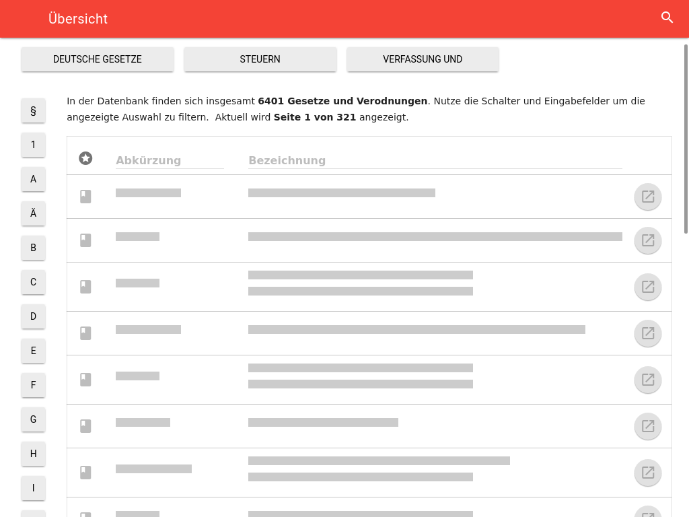

## Client {#sec:client-theory}
Zentral orientiert sich die angestrebte Nutzererfahrung der Applikation an dem 2015 von Alex Russel beschrieben Gesamtkonzept einer \ac{PWA}: Eine \ac{SPA} welche die besten Seiten von nativen mobilen Applikationen und Webapplikationen vereint.[^pwa] Hierbei handelt es sich nicht um ein völlig neues Konzept, sondern vielmehr um eine clevere Kombination von bereits zuvor etablierten Einzelansätzen. Im Mittelpunkt dieser steht eine \ac{SPA} (Abschnitt @sec:spa), mit offline- (Abschnitt @sec:offline-first) sowie mobile-first (Abschnitt @sec:mobile-first) Grundsätzen entwickelt. Als Ergänzung zu diesen Grundsätzen wird außerdem von den von modernen Mobilsystemen zur Verfügung gestellten Möglichkeiten zur Beeinflussung der Applikationsumgebung über HTML-Metatags oder einem Manifest (vergleichbar mit dem für native Applikationen) Gebrauch gemacht.

Als die zentrale architektonische Grundlagen für die Applikation wird eine Komponenten-Hierarchien (Abschnitt @sec:components) mit einem uni-direktionalem Datenfluss (Abschnitt @sec:dataflow) von unveränderbaren Datenstrukturen (Abschnitt @sec:immutable) vorgestellt und eingesetzt. Diese wird dabei im starkem Kontrast zum traditionell verbreiteten \ac{MVC}-Konzept diskutiert.

[^pwa]: Quelle: [infrequently.org/2015/06/progressive-apps-escaping-tabs-without-losing-our-soul](https://infrequently.org/2015/06/progressive-apps-escaping-tabs-without-losing-our-soul/); Abgerufen 08.2016


### Single Page Applications {#sec:spa}
Traditionell wird bei dem Aufruf einer Webseite ein einzelnes HTML-Dokument vom Server an den Client übertragen, welches alle Informationen in einer bereits für die Darstellung strukturierten Form beinhaltet. Jede Interaktion mit einer solchen Webseite führt zu einer neuen Anfrage an den Server welcher daraufhin eine neue Seite gegebenenfalls individuell für den anfragenden Client generiert und zur Verfügung gestellt. Diesen Kreislauf von Anfrage an den Server, Darstellung der Webseite und Nutzerinteraktion mit dieser bezeichnet man als *vollständigen Rundtrip*, da bei jede Wiederholung dieser drei Aspekte gewissermaßen einem Neuanfang gleichkommt.

In Abbildung @lst:website wird dieser Kreislauf beispielhaft durchnummeriert dargestellt: Nach einer initialen Anfrage an den Server (1) antwortet dieser mit einer Webseite (2) mit welcher der Nutzer interagiert (3). Diese Interaktion löst eine Anfrage an den Server aus (4) welcher eine neue Webseite bereitstellt (5). Diese neue Webseite kann sich zwar inhaltlich mit der alten überschneiden, muss aber vom Client komplett neu interpretiert werden. An dieser Stelle beginnt der Kreislauf erneut: Der Nutzer interagiert mit der Seite (6), was in einer Anfrage an den Server resultiert (7) und so weiter.

Listing: Synchrone Client-/Server-Kommunikation

```{#lst:website .dot}
digraph G {
  node [shape=rect]
  SERV [label="Server"]
  APP1 [label="Website"]
  APP2 [label="Website"]
  APP3 [label="[...]" shape=none]
  USER [label="User"]
  VOID [style=invis]

  VOID -> SERV [label="(1) initial req."]
  SERV:sw -> APP1 [label="(2) res."]
  USER -> APP1 [label="(3) action"]
  APP1 -> SERV:s [label="(4) req."]
  SERV -> APP2:nw [label="(5) res."]
  USER -> APP2 [label="(6) action"]
  APP2 -> SERV [label="(7) req."]
  SERV -> APP3 [style=dashed]
  APP1 -> APP2 [style=dotted]
  APP2 -> APP3 [style=dotted]

  // Formatting hacks.
  USER -> APP3 [style=invis]
  VOID [label=""]
  VOID -> USER [style=invis]
  {rank=min;SERV}
  {rank=same;APP1 APP2 APP3}
  {rank=same;VOID USER}
  {rank=max;USER}
}
```

Nachdem dieser Ansatz zu Beginn der breiteren Verbreitung von \ac{AJAX} durch einzelne interaktiven Elementen erweitert wurde, wird bei einer \ac{SPA} der Rundtrip vollständig abgelöst. Dieses Modell wird in Abbildung @lst:spa dargestellt. Am Anfang steht dabei wieder eine initiale Anfrage an den Server (1) woraufhin dieser die Webseite zur Verfügung stellt (2). Im Kontrast zur normalen Webseite schaltet sich nun der bei dieser Anfrage übertragene JavaScript-Code zwischen Nutzerinteraktionen und Server (gestrichelte Kanten). Nutzerinteraktionen werden nun direkt von der Applikation selbst verarbeitet, ohne unmittelbar in einer Anfrage an den Server zu resultieren (3+). Das Skript kümmert sich dabei anschließend nicht nur um einzelne interaktive Inhalte, sondern auch um die Navigation innerhalb der Seite. Auch für das Absetzen eventueller Serveranfragen (4+) und die Aktualisierung der dargestellten Ansicht entsprechend ankommender Daten (5+) ist nun der JavaScript-Code verantwortlich. Serveranfragen in Folge von Nutzeraktionen sind von nun an allerdings oftmals optional da, je nach Implementation, benötigte Daten möglicherweise schon bei vorhergehenden Anfragen geladen wurden.

Die Abbildung stellt den Content- und \ac{API}-Server bereits als zwei strukturell unabhängige Instanzen dar. Obwohl diese Trennung optional ist, ist sie oft erstrebenswert. Siehe hierzu Abschnitt @sec:server, Server.

Listing: Asynchrone Client-/Server-Kommunikation

```{.dot #lst:spa}
digraph G {
  rankdir=BT
  node [shape=rect]
  USER [label="User"]
  SERV [label="Content-Server"]
  API [label="API-Server"]
  APP [label="Single-Page-Application"]
  {rank=same;SERV API}
  {rank=same;USER APP}

  USER -> SERV [label="(1) initial req."]
  SERV -> APP [label="(2) res.   "]
  USER -> APP [label="(3+) actions" style=dashed]
  APP  -> API [label="(4+) req.   " style=dashed]
  API  -> APP [label="(5+) res." style=dashed]
}
```

Durch die zentrale Anforderung an die im Rahmen dieser Arbeit entwickelte Applikation sich ähnlich nativer Software zu verhalten ist die Entwicklung einer \ac{SPA} unabdingbar. Durch den Einsatz einer \ac{SPA} ist es möglich Interaktionen sehr viel flüssiger zu handhaben: Ladezeiten können durch das Vorladen von Daten im Hintergrund und die, durch die fehlende Notwendigkeit strukturelle Informationen zu übertragen, kleinere Größe der benötigten Daten verringert werden. Außerdem ist es möglich durch visuelle Anpassungen wie Animationen ein flüssigeres Nutzungserlebnis zu simulieren, wo bei traditionellen Webseiten eine von Stillstand geprägte Wartezeit zu finden war.

Hierbei ist es wichtig zu bemerken, dass durch den Einsatz einer \ac{SPA} nicht unbedingt die Vorteile einer Webseite verloren gehen. Der direkt Einstieg in eindeutige Pfaden und auch das teilen solcher bleibt erhalten -- oft ein Vorteil gegenüber nativen Applikationen.

Ein Problem daran den Großteil der Arbeit erst auf Clientseite zu verrichten ist, dass es im Vergleich zu einer traditionellen Webseite zu einem verlängerten Seitenaufbau kommen kann. Um dies zu vermeiden kann der für JavaScript einzigartige Vorteil es auf Client und Server ausführen zu können genutzt werden. So ermöglicht React-Framework (mehr zu diesem in Abschnitt @sec:components) sogenanntes \ac{SSR}: hierbei wird die \ac{SPA} universell auch auf dem Server zum generieren der angefragten Ansichten eingesetzt, so dass ähnlich zu traditionellen Webseiten die vorbereitete Ansicht an den Client übertragen werden kann. Dadurch ergibt sich das beste aus beiden Ansätzen: der initiale Seitenaufbau wird nicht durch die Ausführung des JavaScript-Codes verlangsamt woraufhin alle weiteren Änderungen dynamisch lokal ausgeführt werden. Problematisch hierbei ist die zusätzliche Belastung des Servers, besonders bei für jeden Nutzer individuell zusammengestellten Inhalten. Obwohl geplant ist dies langfristig umzusetzen, war es im Rahmen dieser Arbeit nicht möglich das \ac{SSR} effizient genug für den Produktiveinsatz zu gestalten.

Stattdessen wird allerdings auf einen Zwischenweg gesetzt, die sogenannten *App-Shells*. Diese werden durch den gleichen auch für \ac{SSR} eingesetzten Code erstellt, dann allerdings als statische HTML-Seiten abgespeichert und ausgeliefert. Dabei wird an Stelle von dynamischen Inhalten auf Platzhalter gesetzt, welche dem Nutzer einen Eindruck über die zu erwartenden Daten gewähren und dadurch die gefühlte Performance verbessern. Zusätzlich kann in diese App-Shells auch ein Grundbestand der für einen Großteil der initial aufgerufenen Ansichten notwendigen Datensatzes eingebunden werden. Im Fall von Lawly sind dies beispielsweise die für die Darstellung der jeweils ersten Seite der nach Anfangsbuchstabe der Gesetzeskürzel unterteilten Gesetzesübersicht. Diese können daraufhin unmittelbar dargestellt werden während im Hintergrund der restliche Datensatz vorgeladen wird.

{#fig:appshells .shadow caption="Gesetzesübersicht App-Shell (Tablet, horizontal)"}


### Offline-First {#sec:offline-first}
Ein zentraler Teil der Nutzererfahrung von nativen Mobil- und Desktopanwendungen ist, dass sie, zumindest zu einem gewissen Maße, auch ohne aktive Internetverbindung nutzbar sind. Der zuvor beschrieben Ansatz einer \ac{SPA} birgt bereits die Grundlage um solche Funktionalität auch für eine Webapplikation zu realisieren: Nach dem initialen Laden der Seite werden alle Interaktionen des Nutzers von dem geladenen JavaScript gehandhabt. Interaktionen, für welche die Applikation keine weiteren Anfragen an den Server stellen muss, sind so also schon ohne eine Internetverbindung durchführbar. Bei einem erneuten Aufruf der Seite und bei der Verwendung von Teilen der Applikation, welche auf Serveranfragen angewiesen sind, ist allerdings ohne weitere Maßnahmen eine bestehende Internetverbindung notwendig.

Initial gilt es, den wiederholte Seitenaufrufe auch ohne Internetverbindung zu ermöglichen. Hierfür gibt es zwei standardisierte Technologien: Den *Application Cache* und *Service Worker*. Obwohl Service Worker die mächtigere Technologie sind, wird für Lawly, aufgrund der mangelnden Verfügbarkeit von Service Workern auf Apple Geräten, auf den Application Cache gesetzt.[^cantuseserviceworker] Der Application Cache erlaubt es mithilfe eines *Cache Manifest* zuverlässig Dateien zu definieren, welche auch ohne Internetverbindung verfügbar sein sollen. Das ausführende System kümmert sich dann darum diese im Hintergrund zu laden und zu aktualisieren. Zukünftige Aufrufe der Applikation werden aus dem Cache ohne jegliche Netzwerklatenzen beantwortet. Dies hat den zusätzlichen Vorteil den Server und auch das eventuell limitierte Datenvolumen des Clients zu schonen: die im Manifest aufgeführten Dateien werden nur erneut abgerufen falls eine Änderung am Manifest vorgenommen wurde. Ansonsten wird bei jedem Seitenaufruf nur das Manifest vom Server abgefragt.

[^cantuseserviceworker]: Safari, welcher unter iOS auch als Grundlage für die Browser Dritter dient, implementiert noch keine Service Worker. Quelle: [caniuse.com](http://caniuse.com/#feat=serviceworkers); Abgerufen 08/2016.

Um nicht nur statische Dateien bei fehlender Internetverbindung zur Verfügung stellen zu können gilt es, Anfragen innerhalb der Applikation so zu gestalten, dass sie nicht nur durch Zugriff auf die \ac{API}, sondern auch aus einem auf dem Gerät zur Verfügung stehenden lokalen Speicher beantwortet werden können. Um dies zu ermöglichen wird auf eine zentrale Klasse gesetzt, welche sämtliche \ac{API}-Anfragen verwaltet. Um auch hier Latenzen zu vermeiden bevorzugt diese Klasse beim Beantworten von Anfragen den lokalen Speicher gegenüber der externen \ac{API}. Falls also die gesuchten Daten im lokalen Speicher vorhanden sind, werden diese unmittelbar verarbeitet. Gleichzeitig hierzu wird auch eine Frage an die externe Schnittstelle gestellt, mit deren eventueller Antwort gegebenenfalls die zuvor bereits durchgeführte Verarbeitung erneut ausgeführt sowie die lokal zwischengespeicherten Daten aktualisiert werden.

Zu guter Letzt ist es nicht nur notwendig, relevanten Daten ohne Internetverbindung verfügbar zu machen, sondern auch Interaktionen lokal zu simulieren und bei Wiedererlangen einer Verbindung mit dem Server abzugleichen. Dies nennt sich optimistische Aktualisierungen, da Aktionen gewissermaßen optimistisch lokal durchgeführt und erst im Nachhinein mit dem Server abgeglichen und eventuell durch den von diesem vorgegebenen faktischen Zustand überschrieben werden. Auch hierbei ist wieder die im letzten Absatz beschrieben zentrale Klasse zum Verwalten von Anfragen hilfreich. Falls diese feststellt, dass eine manipulierende Anfrage an den Server(also die HTTP-Methoden `PUT`, `POST` oder `DELETE`) fehlgeschlagen ist, werden die notwendigen Informationen gespeichert und die Anfrage bei wiedererlangen einer Verbindung zur \ac{API} erneut ausgeführt.

Die Folge der bei einem solchen optimistischen Nutzerinterface ausgeführten Operationen wird abstrahiert in Abbildung @lst:optimisticui dargestellt. Gestrichelte Kanten sind in der Darstellung solche, die auf eine Internetverbindung angewiesen und von Verbindungslatenzen betroffen sind. Die leitende Zahl an jeder Kante spezifiziert auch hier wieder die Ausführungsordnung.

Listing: Optimistische Nutzerinterfaces

~~~{.dot #lst:optimisticui}
digraph G {
  rankdir=RL
  API [label="API-Server"]
  Application -> ApiClient [label="(1) request"]
  ApiClient -> Application [label="(2) expected response"]
  ApiClient -> API [label=" " style=invis]
  ApiClient -> API [label="(3) request" style=dashed]
  API -> ApiClient [label="(4) response" style=dashed]
  ApiClient -> Application [label="(5) factual response" style=dashed]
}
~~~

Da die Umsetzung solcher lokaler Speicher in den verschiedenen Browser stark variieren, wird auf die *localForage* Bibliothek der Mozilla Foundation gesetzt. Zwar bieten manche moderne Browser bereits sehr mächtige lokale Datenbanken, allerdings kommt für dieses Projekt eine Einschränkung auf diese wenigen Plattformen nicht in Frage. *localForage* ermöglicht es in allen verbreiteten Browsern zuverlässig einen implementationsunabhängigen Key/Value-Store einzusetzen.[^browsers]

[^browsers]: Die einzigen durch *localForage* nicht unterstützten Browser sind Versionen <8 des Internet Explorers, welche auf einen Marktanteil von unter 1% kommen. Quelle: https://www.netmarketshare.com/browser-market-share.aspx; Abgerufen 08/2016.


### Mobile First {#sec:mobile-first}
Ein weiterer zentraler Aspekt einer \ac{PWA} ist, dass sie auf sämtlichen Endgeräten gleichermaßen komfortabel verwendbar ist. Dabei gilt es dem *mobile-first* Ansatz zu folgen: das gesamte Nutzerinterface wird demnach initial für einen kleinen Smartphone-Bildschirm, gewissermaßen das schwächsten Glied der Kette, entwickelt. Dabei wird auf flexible Komponenten gesetzt, welche sich bei Verfügbarkeit von mehr Platz, also zum Beispiel auf Tablets oder Desktopbildschirmen, fließen umverteilen und ausbreiten.


### Modularisierung
Software Projekte aller Art leiden ab einer gewissen Größe unter ihrem eigenen Funktionsumfang -- der zu Grunde liegende Code läuft Gefahr mit wachsendem Umfang unübersichtlich zu werden. Um dies zu vermeiden ist eine klare Codestruktur notwendig. Für Endnutzer-Applikationen hat sich diesbezüglich das \ac{MVC} Prinzip etabliert. Dieses beschreibt den Ansatz jede einzelne Ansicht einer Applikation durch drei ineinander verankerte Einzelteile zu beschreiben. Knapp zusammenfassend steht dabei der *Controller* als Verantwortlicher für das durchführen von Aktionen und verarbeiten von Daten im Mittelpunkt. Dabei stellt er dem *View*, welcher für die Visualisierung zuständig ist, Informationen und Aktionen bereit. Das *Model* liegt gewissermaßen im Hintergrund und stellt dem Controller eine Schnittstelle zu den Rohdaten zur Verfügung.

Mit der fortschreitenden Entwicklung zu dynamischeren und stärker in ihren Ansichten ineinander verzahnten Applikationen hat sich dieser Ansatz allerdings als problematisch erwiesen. Es ist nicht länger der Fall, dass eine einzelne Funktionalität nur in einer bestimmten Ansicht dargestellt wird. Einzelne Bestandteile einer Applikation interagieren immer stärker miteinander, wobei es notwendig ist, alle vom gleichen Datensatz abhängige Modelle synchron zu halten.

Um dieses Problem anzugehen hat sich speziell in der Web\hyp{}Entwicklung in den letzten Jahren ein neuer Trend zu einer sehr viel stärkeren Modularisierung von Applikationen hervor getan. Die Vielzahl an Models, Views und Controllers werden dabei respektive durch einen Applikationsweiten Zustand, eine Komponenten-Hierarchie und zentral definierte Aktionen abgelöst. In den folgenden Abschnitten wird auf diese Ansätze und die für ihre Anwendung verwendeten Technologien eingegangen.


#### Komponenten-Hierarchien {#sec:components}
Dabei besteht Web\hyp{}Applikation aus einer Vielzahl einzelner, möglichst einfacher Komponenten, welche durch flexible Kombination ein dynamisches Interface ergeben. Eine einzelne Komponente ist dabei ein möglichst in sich geschlossenes System, welches sein Umfeld nicht beeinflusst und nur von einem klar definierten, von außen übergebenen, Zustand abhängt. Also eine direkte Abbildung von einem übergebenen Zustand zu einer Darstellung: `(state) => view`. Durch hierarchische Vererbung an andere Komponenten können so in einer sich ergebenden Baumstruktur komplexe Interfaces umgesetzt werden, in welcher Zustand von oben nach unten vererbt wird. Einzelne Komponenten bleiben so in sich selbst leicht verständlich und gut testbar.

Die verbreitetste Plattform, welche diesen Ansatz gewissermaßen massentauglich machte, ist das JavaScript Framework React. Da die Entwickler bei Facebook, die Firma hinter React, so überzeugt von diesem Ansatz sind, wurde zusätzlich React Native entwickelt, welches die gleichen Prinzipien auf die Entwicklung von nativen Android- und iOS-Applikationen überträgt. Bei der Verwendung von React Native wird die zwar weiterhin in JavaScript entwickelt, allerdings für die Darstellung exklusiv native Komponenten eingesetzt. Während der Kompilierung einer solchen Applikation wird die *Geschäftslogik* von der *Darstellungslogik* getrennt und auf dem Endgerät, anders als im Browser, in zwei sich gegenseitig nicht blockierenden Threads ausgeführt. Da diese Möglichkeit, native Applikationen in JavaScript ohne erlernen weiterer Paradigmen zu entwickeln, ein vollständiges Alleinstellungsmerkmal des React-Ökosystems ist, wurde es als zentrale Bibliothek für die Entwicklung von Lawly gewählt.

Da Änderungen des \acs{DOM} rechenintensiv sind und alle Operationen einer Webseite, wie in Abschnitt @sec:javascript erläutert, nur in einem einzelnen Thread ausgeführt wird, kümmert sich React darum, solche Änderungen zu bündeln. Dafür hält React eine virtuelle Representation des DOMs vor, sammelt in dieser entstehende Änderungen durch innerhalb der Komponenten-Hierarchie und wendet sie gebündelt auf die eigentliche Darstellung im Browser an. Die beiden folgenden verfolgten Ansätze, uni-direktionaler Datenfluss und unveränderbare Datenstrukturen, helfen, diesen Vorgang noch effizienter zu gestalten.


#### Uni-Direktionaler Datenfluss {#sec:dataflow}
Um Komponenten leicht testbar und auch bei starker Verzahnung möglichst unabhängig voneinander zu gestalten, ist es notwendig, den Zustand auszulagern. Hierbei verfolgen wir das Prinzip eines uni-direktionalen Datenflusses. Dabei verfügt die Applikation über einen globalen Zustand (**state** gespeichert im **store**), welcher über die Komponenten-Hierarchie in angebrachten Teilmengen vererbt wird.

Anstatt, dass wie beim \ac{MVC} Prinzip jede Komponente nun den ihr zugeordneten Teil des Zustandes manipuliert, werden solche Veränderungen global ausgeführt; der lokale Zustand ist unveränderbar. Über die gleiche Vererbungsstruktur werden hierfür nicht nur die Daten selbst, sondern auch Funktionen vererbt (sogenannte **action creators**), welche als einzige Einfluss auf den globalen Zustand nehmen können.

Eine von einer solchen Funktion erstellte Aktion (**action**) ist dabei ein einfaches, serialisierbares, Objekt mit klar spezifizierten Typ und Struktur. Wird so eine Aktion auf den store angewendet, transformiert dieser auf ihrer Grundlage den Zustand und vererbt den neuen Zustand wiederum durch die Komponenten-Hierarchie. Durch diese zentrale Aktualisierung und Vererbung wird die Integrität der zur Darstellung einer Komponente dienenden Daten zu jedem Zeitpunkt garantiert.

Listing: Uni-direktionaler Datenfluss

```{.dot #lst:dataflow}
digraph G {
  rankdir=LR
  node [shape=rect]
  S [label="Store" shape=ellipse]
  A [label="Component A"]
  B [label="Component B"]
  C [label="Component C"]
  {rank=same;A B C}
  S -> A [label="state & action creators"]
  A -> B [xlabel="state & action creators"]
  B -> C [xlabel="state & action creators"]
  A -> S [label="action" style=dashed]
  B -> S [label="action" style=dashed]
  C:w -> S:s [label="action" style=dashed]
}
```

Durch diese Zentralisierung von Zustand und Zustand-manipulierenden Aktionen werden die Applikation und insbesondere Zustandsveränderungen innerhalb der Applikation leichter durchschaubar. Zusätzlich entsteht die Möglichkeit den Zustand persistent für zukünftige Aufrufe der Applikation zu speichern, einzelne Aktionen zu simulieren und, da der Zustand niemals direkt verändert sondern nur in einen neuen transformiert wird, gegebenenfalls rückgängig zu machen.

Initial wurde dieser Ansatz 2014 von Facebook unter dem Namen *flux* präsentiert.[^flux] Seitdem wurde das Konzept von der JavaScript-Gemeinschaft intensiv aufgegriffen und hat sich in einer weniger komplexen Form durch die *Redux*-Bibliothek[^redux] durchgesetzt und in diesem Projekt eingesetzt wird.

[^flux]: https://facebook.github.io/flux/docs/overview.html

[^redux]: http://redux.js.org/


#### Unveränderbare Daten {#sec:immutable}
Zur effizienten und konsequenten Umsetzung der beiden zuvor beschrieben Prinzipien wird auf sogenannte unveränderbare Datenstrukturen gesetzt. Dies ergibt Sinn, da der globale Zustand wie zuvor erläutert niemals direkt verändert werden darf.

Der verbreitetere und aus er objektorientierten Programmierung bekannte Ansatz ist es, mit Instanzen von Objekten zu arbeiten, welche während der Laufzeit eines Programms manipuliert werden. Sehr bekannt ist dieses Modell aus der objektorientierten Programmierung, bei welcher Objekte meist Methoden zur Verfügung stellen, über welche ihr Zustand manipuliert werden kann. Das Problem hierbei ist, dass solche Entwicklungsmuster in nicht vorhersehbaren Zuständen resultieren können. In @lst:mutable_javascript ist Beispielhaft die Funktion `take` definiert, welche den Wert eines Attributes eines ihr übergebenen Objektes zurückgibt. Nachträglich verändert sie allerdings den eigentlichen Wert innerhalb des Objektes.[^const] Falls diese Funktion nicht vom sie einsetzenden Programmierer geschrieben auch nur grade nicht direkt vorliegt, könnte dies zu unvorhersehbaren Resultaten im weiteren Programmablauf führen.

[^const]: Interessant hierbei ist auch, dass die Variable \texttt{obj} als \texttt{const}, also Konstante, definiert wurde: Konstant bedeutet hier allerdings nicht, dass der Wert des Objektes unverändert bleibt, sondern die in der Variable gespeicherte Referenz zu einem bestimmten Objekt. Das referenzierte Objekt ist allerdings veränderbar. Obwohl dieses Verhalten bei angehenden Programmierern oft für Verwirrung sorgt, ist es ein auch aus anderen Sprachen wie C++ (\texttt{const}) oder Java (\texttt{final}) bekanntes Verhalten. Unveränderbare Datenstrukturen lösen dies.

Listing: Pass-by-reference und mutierbare Objekte in JavaScript

~~~{.javascript #lst:mutable_javascript}
function take(ref, key) { return ref[key]--; }
const obj = { foo: 42 };
const foo = take(obj, 'foo');
// obj: { foo: 41 }; foo: 42
~~~

Unveränderbare Datenstrukturen lösen dieses Problem, indem jede auf ihnen ausgeführte Operation ein neues Objekt zurückgibt, anstatt das alte direkt zu verändern (siehe Listing @lst:immutable_list).

Listing: Veränderbares Array und unveränderbare Liste in JavaScript

~~~{.javascript #lst:immutable_list}
import { List } from 'immutable';
const arr = [1, 2, 3];
arr.push(4);
// arr: [1, 2, 3, 4]
const list1 = List([1, 2, 3]);
const list2 = list1.push(4);
// list1: [1, 2, 3]; list2: [1, 2, 3, 4]
~~~

Für ein besseres Verständnis kann man *immutables* statt als Objekte als individuelle Werte betrachten. Werte sind in den meisten Programmiersprachen einfache Dinge wie Integer oder Strings. Werden diese verändert, wird immer ein neuer Wert zurück gegeben, niemals der eigentlich mutiert. Objekte hingegen traditionell eher eine Art Sammlung von Referenzen und Werten, welche verändert werden können, ohne das eigentliche Objekt zu ändern. Wird nun auf unveränderbare Datenstrukturen gesetzt, sind auch Objekte als solche Werte zu behandeln: Veränderungen erzeugen einen neuen Wert, ohne den alten direkt zu mutieren.

Um nun nicht bei jeder Mutation eine veränderte tiefe Kopie des originalen Objektes zu erstellen und damit unnötig Speicher zu belegen, wird bei der verwendeten Bibliothek, *immutablejs*, für die interne Repräsentation unveränderbarer Objekte auf sogenannte gerichtete azyklische Graphen mit gemeinschaftlicher Nutzung (eng.: *directed azyclic graphs (DAG) with structural sharing*) gesetzt. In Abbildung @lst:dag_mutation wird dies visualisiert: Im originalen Graph mit Wurzel *a* soll der verschachtelte Kind-Knoten *g* manipuliert werden. Um dies mit möglichst wenig Aufwand zu erreichen und den ursprünglichen Graphen unverändert zu lassen, werden die hier gestrichelt dargestellten Knoten, *a*, *c* und *g*, in Form der gepunkteten Knoten, respektive *a2*, *c2* und *g2*, kopiert. Die Mutation findet auf dem neu erstellten Knoten *g2* statt und der neue Graph mit Wurzel *a2* setzt sich so speichersparend aus, im dargestellten Beispiel zu über 50%, bereits existierende unveränderte Knoten zusammen (durchgezogene Umrandungen). Falls nirgendwo im System mehr eine Referenz auf den Ursprungsgraphen *a* besteht, werden die gestrichelten Knoten automatisch von der Speicherbereinigung endgültig gelöscht.[^leebyron]

[^leebyron]: Beispiel aus Lee Byron's Talk "Immutable Data and React". Quelle: [youtu.be/I7IdS-PbEgI](https://youtu.be/I7IdS-PbEgI), abgerufen 08/2016.

Listing: Mutation eines gerichteten azyklischen Graphen mit gemeinschaftlicher Nutzung

~~~{#lst:dag_mutation .dot format=png width=.7\\textwidth}
digraph G {
  node [shape=circle];
  splines=false;
  a -> {b c} [style=dashed]
  b -> {d e f}
  c -> g [style=dashed]
  g -> h [style=dashed]

  a [style=dashed]
  c [style=dashed]
  g [style=dashed]
  a2 [style=dotted]
  c2 [style=dotted]
  g2 [style="dotted,filled"]
  a2 -> {b c2} [style=dotted]
  c2 -> g2 [style=dotted]
  g2 -> h [style=dotted]

  // Formatting hacks
  a -> a2 [style=invis]
  b -> c [style=invis]
  c -> c2 [style=invis]
  g -> g2 [style=invis]
  h2 [style=invis]
  h -> h2 [style=invis]
  g2 -> h2 [style=invis]
  bc [style=invis]
  b -> bc [style=invis]
  {rank=same;a a2}
  {rank=same;b bc c c2}
  {rank=same;g g2}
  {rank=same;h h2}
}
~~~

Insgesamt ergibt sich aus der Verwendung von unveränderbaren Datenstrukturen so gleich mehrere Vorteile: Einerseits ist es, wie bereits erläutert, für Entwickler leichter über Veränderungen von Datenstrukturen zu urteilen. Außerdem ermöglichen unveränderbare Datenstrukturen es, effizient zu prüfen ob die Aktualisierung einer Komponente bei Veränderung des globalen Zustands überhaupt notwendig ist -- wenn sich also der übergebene Zustand in seiner Identität gleich ist, hat er sich nicht verändert. Bei traditionellen Objekten wäre es hier notwendig einen tiefen Vergleich jedes Attributes durchzuführen.
