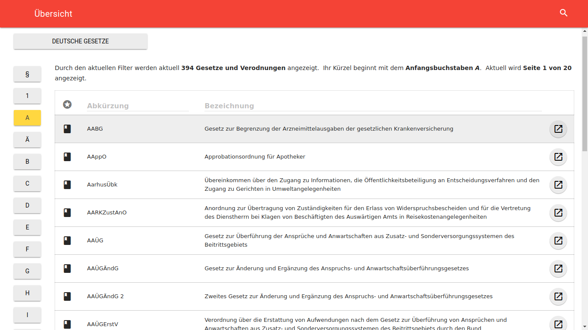
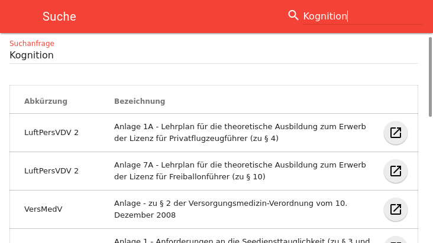

## Client Architektur {#sec:client-architecture}
Ähnlich dem Abschnitt @sec:server-architecture setzt auch die Client Applikation im Sinne einer besseren Übersichtlichkeit und Testbarkeit auf stark modularen Code. Da eine komplette Analyse des Applikationsquelltextes bei rund 6000 Zeilen Code den Rahmen dieser Arbeit sprengen würde, wird im folgenden Beispielhaft anhand der Gesetzesübersicht die konkrete Implementation erläutert. Zusätzlich wird die offline Suchfunktion, ein sich in der Umsetzung als sehr anspruchsvoll erwiesener Teil der Applikation, analysiert. Da das Ziel der Implementation ein nicht nur theoretisch, sondern auch praktisch an Browser auslieferbares Paket sein soll, wird zu guter letzt der Buildprozess besprochen.

### Struktur
Listing: Ordnerstruktur der Client-Applikation

~~~{#lst:folders}
components/
containers/
helpers/
modules/
store/
client.js
shells.js
~~~

Der Quelltext der Anwendung setzt sich vereinfacht durch die in Listing @lst:folders dargestellte Ordnerstruktur zusammen. Hierbei sind die beiden aufgeführten JavaScript-Dateien, `client.js` und `server.js` die jeweiligen Einstiegspunkte für den Bundler (siehe @sec:bundler). Respektive sind sie für einerseits die Generierung des an den Browser zu übertragene JavaScript-Paket und andererseits die Generierung der App-Shells verantwortlich.

Hinter den oben aufgeführten Ordnern befinden sich die reinen React-Komponenten (siehe @sec:react), die Redux-Module (siehe @sec:redux) und die React-Redux-Container, welche für die Verbindung der beiden letzteren Verantwortlich sind. Der Store ist der zentrale Anlaufpunkt für den kompletten Datenfluss auf Clientseite und Helpers sind sonstige allgemein relevante Funktionalitäten welche nicht den vorhergehenden Kategorien zuordenbar sind.

### Offline-Funktionalität {#sec:offline}
Wie zuvor dargelegt, ist die Funktionalität der Applikation auch ohne Internetverbindung zu gewährleisten. Um dies zu erreichen werden mehrere Aspekte umgesetzt.

<!-- TODO: Create wrapfigure pandoc filter. -->
\begin{wrapfigure}{R}{0.45\textwidth}
  \tikz\node[blur shadow={shadow blur steps=5}, style={inner sep=0, outer sep=0}]{
    \includegraphics[width=0.45\textwidth, frame, right]{assets/newversion}
  };
  \caption{Aktualisierung (Smartphone, vertikal)}
  \label{fig:newversion}
\end{wrapfigure}

Einerseits wird beim Bundling der Applikation (siehe Abschnitt @sec:bundler) ein Cache Manifest erstellt, welches Informationen über vom *Application Cache* (siehe Abschnitt @sec:offline-first) vorzuhaltende Dateien beinhaltet. Sobald diese einmal geladen wurden werden alle zukünftigen Anfragen aus dem Cache beantwortet und der Server nur nach einem geänderten Manifest befragt. Ändert sich das Manifest, wird der Cache im Hintergrund und die Webseite entweder durch Neuladen (als Reaktion auf die in Abbildung @fig:newversion dargestelle Benachrichtigung) oder beim nächsten Aufruf aktualisiert.

Anderseits gilt es Anfragen an den API-Server zumindest teilweise optional zu gestalten. Um dies zu erreichen wurde die `ApiClient`-Klasse entwickelt, welche für alle Anfragen an den Server und auch die lokale Suche (mehr dazu in Abschnitt @sec:localsearch) zuständig ist. Innerhalb der Applikationen werden zur einfacheren Handhabung API-Anfragen als serialisierbare Objekte dargestellt (siehe Abbildung @lst:serializablerequests). Diese Objekte werden von der ApiClient-Klasse je nach beinhalteter Attribute unterschiedlich gehandhabt.

Ist eine Anfrage zum Beispiel `cachable`, so wird zuerst der lokalen Key/Value-Store angefragt -- in diesem dienen die Request-Objekte als Schlüssel. Liefert der ein Ergebnis wird mit, falls spezifiziert, mit diesem unmittelbar die Redux-Aktion (`action`-Attribut) ausgeführt. Daraufhin wird getestet ob für diesen Cache-Wert ein Ablaufdatum gesetzt ist und ob dieses überschritten wurde -- wenn letzteres gilt oder überhaupt kein Ablaufdatum vorhanden ist, wird die Anfrage an den Server gestellt, der Cache bei erhalten einer Antwort aktualisiert und erneut die Redux-Aktion mit den aktualisierten Werten aufgerufen.

Listing: Serialisierbares API-Request Objekt auf Clientseite

~~~{#lst:serializablerequests .javascript}
const urhgRequest = {
  method: 'get', cachable: true,
  name: 'laws', groupkey: 'urhg',
  action: FETCH_SINGLE
};
~~~

Um auch bei nicht zwischenspeicherbaren Anfragen wie zum Beispiel dem Vormerken von Gesetzen eine fließende Nutzererfahrung zu bieten, können Anfragen simuliert werden. Dafür wird das zu gewissermaßen vorhergesagte Ergebnis als *payload*-Attribut an das lokale Request-Objekt angehangen und damit die Redux-Aktion auch ohne vorhandenen Cache unmittelbar ausgelöst.

[^apiclient]: [lawly_web/src/helpers/ApiClient.js](https://github.com/ahoereth/lawly_web/blob/master/src/helpers/ApiClient.js)

[^canicache]: http://caniuse.com/#feat=offline-apps

### Beispielhaft: Die Gesetzesübersicht
Im folgenden wird beispielhaft für die gesamt Architektur detailliert die Implementation der Gesetzesübersicht, siehe Abbildung @fig:lawindex, behandelt. Diese listet die Gesetze auf, bietet die Möglichkeit über die Buch-Icons links in der Tabelle Gesetze zu speichern und über die Action-Buttons rechts die Individualansichten aufzurufen. Zusätzlich werden mehrere Möglichkeiten zur Filterung angeboten: Ganz oben kann aus einer (noch zu erweiternden) Liste von Sammlungen gewählt werden und über die Schalter links nur Gesetze mit einem bestimmten Kürzel-Anfangsbuchstaben angezeigt werden. Mit den drei Tabellenkopfspalten können außerdem nur markierte Gesetze oder nur welche mit einem bestimmten Bestandteil in Kürzel oder Titel angezeigt werden. Damit der Nutzer trotz der vielen Optionen den Durchblick behält werden direkt über der Tabelle die gewählten Filter und deren Ergebnismenge knapp in natürlicher Sprache zusammengefasst.

{#fig:lawindex .shadow caption="Gesetzesübersicht (Desktop)"}

Die für diese Darstellung entwickelten Redux-Modulen und React-Komponenten werden als Vererbungshierarchie in Abbildung @lst:lawindex_graph dargestellt -- zusätzlich verwendete Elemente wie das übergeordnete Layout oder untergeordnete Komponenten aus anderen Bibliotheken wurden dabei ausgelassen.

Die Gesetzesübersicht benötigt die Daten aus zwei *Redux-Modulen*: dem `lawIndexModule`[^lawindexmodule] und dem `userModule`[^usermodule]. Redux-Module sind dabei eine Zusammenfassung von für das Arbeiten mit einem bestimmten Teil des Zustandes nötigen Funktionalitäten. Dies sind einerseits Selektoren, zum strukturierten Lesen von Daten, und anderseits Action-Creators, zum Eintragen und Manipulieren von Daten (siehe Abschnitt @sec:dataflow). Durch die Zentralisierung dieser Bestandteile wird eine einheitliche Interaktion mit dem Zustand garantiert.

Im Mittelpunkt des Graphen steht der ausgefüllt abgebildete `LawIndexContainer`[^lawindexcontainer] : Er ist die Schnittstelle zwischen Redux-Modulen und React-Komponenten. Obwohl in der Implementation eigentlich selbst eine Komponente, ist diese Trennung wichtig, da so alle ihm untergeordneten Komponenten vollständig ohne Wissen über die Herkunft ihrer Daten verwendet und dementsprechend einfach getestet werden können.

Listing: Modulhierarchie Gesetzesübersicht

~~~{#lst:lawindex_graph .dot}
digraph G {
  node [shape=rect]
  store [shape=square]
  lawIndexModule [shape=oval]
  userModule [shape=oval]
  store -> {lawIndexModule userModule}

  // moduleX [label="..." style=dashed]
  // store -> moduleX [style=dashed]
  // containerX [label="..." style=dashed]
  // lawIndexModule -> containerX [style=dashed]
  // userModule -> containerX [style=dashed]

  LawIndexContainer [style=filled fillcolor=lightgray]
  lawIndexModule -> LawIndexContainer
  userModule -> LawIndexContainer
  LawIndexContainer -> LawIndex

  LawIndex -> {LawInitialChooser LawCollectionChooser LawIndexLead LawList}
  {rank=same; LawInitialChooser LawCollectionChooser LawIndexLead LawList}
  LawList -> {Pagination DataTable}
}
~~~

Die Gesetze erhält der Container durch die Selektoren des Gesetzesindex-Moduls. Da der Zustand aber zentralisiert ist, filtert der Container diese nicht selbst. Stattdessen werden über die Action Creators die vom Nutzer angewendeten Filter in den Zustand geschrieben, welcher dann durch die Hierarchie propagiert wird. Dabei werden auch die Selektoren von der Neuerung benachrichtigt und filtern den Index neu.

Die Selektoren gestalten komplexe Transformationen durch die Verkettung von reinen (nebeneffektfreien) Funktionen einfach und mithilfe von Memorisierung der in der Kette entstehenden Zwischenergebnissen effizient. Dies wird in Listing @lst:lawsByInitial dargestellt. Bei der Auswahl des Anfangsbuchstaben *B* (Abbildung @fig:lawindex) muss so das Ergebnis des `getLawsByCollection`-Selektors[^lawindexmodule] nicht neu berechnet werden, da seine Eingabewerte sich nicht verändert haben. In der Kette weiter hinten angesetzte Selektoren, wie zum Beispiel für die aktuell angezeigte Seite (Seitenschalter nicht im Bild), werden, da sich ihre Eingabe geändert hat, automatisch neu berechnet. Der Container erhält so nur das bereits endgültig gefilterte Ergebnis und reicht es an die ihm untergeordneten Komponenten weiter.

Listing: Ausschnitt der Gesetzesübersicht-Selektoren

~~~{#lst:lawsByInitial .javascript}
import { createSelector } from 'reselect';
const getLawIndex = state => state.get('law_index');
const getCollection = state => state.get('collection');
const getInitial = state => state.get('initial');
const getLawsByCollection = createSelector(
  [getLawIndex, getCollection],
  (laws, collection) => laws.filter(/*[...]*/)
);
const getLawsByInitial = createSelector(
  [getLawsByCollection, getInitial],
  (laws, initial) => laws.filter(law =>
    law.get('groupkey')[0].toLowerCase() === initial
  )
);
export const getLawsByPage = createSelector(/*[...]*/);

~~~

Die direkt unter dem `LawIndexContainer` angeordnete Komponente ist `LawIndex`.[^lawindex] Diese ist zentral nur für die Weiterverteilung der ihr übergebenen Attribute und die visuelle Aufteilung der Ansicht zuständig.

Bei Blick auf Listing @lst:LawIndex fällt auf, das für die Umsetzung der Komponentenhierarchie kein reines JavaScript, sondern *JSX* eingesetzt wird. JSX orientiert sich an der von HTML bekannten Struktur, welche durch ihre hierarchische Natur für die Darstellung von Komponenten-Hierarchien sehr gut geeignet ist. Obwohl es auch möglich ist, React ohne diese rein visuelle Vereinfachung zu nutzen, wird so viel unnötiger Code gespart und Übersichtlichkeit gewonnen. Außerdem wird hier die Einfachheit des funktionellen Ansatzes klar: Reine Komponenten sind nur eine direkte Abbildung ihrer Eingabe zu einer Darstellung. React kümmert sich hierbei wieder um die Effizienz. Ähnlich wie bei den zuvor beschrieben Selektoren wird eine solche Abbildung nur erneut berechnet, wenn sich ihre Eingabe verändert hat -- durch den Einsatz von in Abschnitt @sec:immutable beschriebenen unveränderbaren Datenstrukturen ist dieser Vergleich besonders effizient umsetzbar.

Listing: Vereinfachte `LawIndex` Komponente

~~~{#lst:LawIndex .javascript}
import { Grid, Cell } from 'react-mdl';
const LawIndex = ({
  initials, selectInitial, selectedInitial, /* [...] */
}) => (
  <Grid>
    <Cell>
      <LawCollectionChooser {/* [...] */} />
    </Cell>
    <Cell>
      <LawInitialChooser
        initials={initials}
        selected={selectedInitial}
        onSelect={selectInitial}
      />
    </Cell>
    <Cell>
      <LawIndexLead {/* [...] */} />
      <LawList {/* [...] */} />
    </Cell>
  </Grid>
);
~~~

Erst in der ihr untergeordneten Ebene wird mit den Daten im eigentlichen Sinne gearbeitet. Wieder beispielhaft zeigt dafür Listing @lst:LawInitialChooser die Komponente zur Darstellung der Initialen-Auswahl: diese bildet, wiederum als reine Funktion, die übergebene Liste von Initialen auf die einzelnen Schalter ab. Per `onClick`-Handler wird das Initial eines Schalters über die übergebene `onSelect`-Funktion an den Store gesendet und durch die Propagierung des aktualisierten Zustandes der Schalter dessen `initial` mit dem `selected` Wert übereinstimmt farbig dargestellt.

Listing: Vereinfachte `LawInitialChooser` Komponente

~~~{#lst:LawInitialChooser .javascript}
import { Grid, Cell, Button } from 'react-mdl';
const LawInitialChooser = ({
  initials, selected, onSelect
}) => (
  <Grid>
    {initials.map(initial => (
      <Cell>
        <Button
          colored={initial === selected}
          onClick={() => onSelect(initial)}
        >
          {initial}
        </Button>
      </Cell>
    ))}
  </Grid>
);
~~~

Obwohl die `LawInitialChooser`-Komponente ist ein Blattknoten des Graphen aus Abbildung @lst:lawindex_graph ist, vererbt sie noch weiter an importierte Komponenten aus der `react-mdl` Bibliothek. Diese Bibliothek ist eine Implementierung von Googles Material Design Guidelines auf Grundlage von HTML-Elementen wie `div` oder `button`. An dieser Stelle ist es allerdings auch denkbar, dass statt HTML-Elementen native Android- oder iOS-Elemente eingesetzt werden -- der hier implementierte Code ist von einer solchen Implementation unabhängig. Einem späteren Austausch der `react-mdl`-Komponenten durch native Komponenten für eine native Umsetzung einer Applikation mit ähnlicher Funktionalität steht also nichts im Wege.

[^lawindexmodule]: [lawly_web/src/modules/law_index.js](https://github.com/ahoereth/lawly_web/blob/master/src/modules/law_index.js)

[^usermodule]: [lawly_web/src/modules/user.js](https://github.com/ahoereth/lawly_web/blob/master/src/modules/user.js)

[^lawindexcontainer]: [lawly_web/src/containers/LawIndexContainer.js](https://github.com/ahoereth/lawly_web/blob/master/src/containers/LawIndexContainer.js)

[^lawindex]: [lawly_web/src/components/laws/LawIndex.js](https://github.com/ahoereth/lawly_web/blob/master/src/components/laws/LawIndex.js)

### Problematisch: Lokale Suche {#sec:localsearch}
Als ein Teil der zentralen Funktionalität der Applikation gilt es die Volltextsuche auch ohne Internetverbindung zur Verfügung zu stellen. Das Problem hierbei: Volltextsuche ist auf nicht dafür dedizierten Systemen sehr rechenintensiv.

{#fig:search .shadow caption="Volltextsuche (Smartphone, horizontal)" width=.7\\textwidth}

Für die Gesetzesübersicht, beschrieben im vorhergehenden Abschnitt, wird das Filtern durch die Anwendung von regulären Ausdrücken in einer Schleife über die Gesetze realisiert. Da die Zahl dieser nur bei ungefähr 7000 liegt und nur nach Kürzel und Bezeichnung gefiltert wird, ist dies noch durch die beschriebene Memorisierung performant umsetzbar. Bei der Volltextsuche gilt es allerdings auch die individuellen Normen und insbesondere deren Textkörper zu durchsuchen. Hierbei wächst die Datenmenge mit der Nutzung der Applikation durch den individuellen Nutzer -- speichert er mehr Gesetze für die offline Verwendung ab, gilt es auch mehr Gesetze zu durchsuchen.

Anders als bei anderen Teilen der Applikation wird hierbei standardmäßig solange eine Internetverbindung verfügbar ist nicht auf die lokale Implementation gesetzt. Stattdessen wird um umfassende Ergebnisse über den gesamten Corpus von ca. 113.000 Normen zu liefern eine Suche durch die Serverseitige PostgresSQL Datenbank bevorzugt.

Falls der API-Server nicht verfügbar ist wird lokal gesucht. Hierbei hat sich als sehr problematisch erwiesen, dass eine Webapplikation inklusive der Darstellung nur in einem einzelnen Thread ausgeführt wird. Blockiert also das JavaScript durch sequentielle Operationen diesen Thread, ist auch die dargestellte Webseite nicht reaktionsfähig. So wäre es zum Beispiel während einer Suche nicht möglich die Suchanfrage im Eingabefeld zu verfeinern. Zusätzlich ist nicht nur die eigentliche Suche sondern auch das erstellen des notwendigen Suchindexes sehr rechenintensiv und würde wenn im gleichen Thread ausgeführt das Starten der Applikation massiv verlangsamen. Um dies zu umgehen wird ein *Web Worker* eingesetzt.

Web Worker sind eine in neueren Browsern[^caniwebwork] zur Verfügung gestellte Funktionalität zum Auslagern von JavaScript-Operationen in einen gesonderten Prozess. Dabei wird zwischen dem Hauptprozess und dem Web Worker ähnlich wie auf Serverseite beim Eintreffen von Anfragen über Ereignisse kommuniziert. Um dies auf Clientseite zu abstrahieren wurden zwei Klassen entwickelt: `LocalSearch`[^localsearch] und `LocalSearchWorker`[^localsearchworker]. Erstere wird von der zentralen API-Abstraktion (siehe @sec:offline-first) auf ähnliche Weise wie der \ac{API}-Server angesprochen und Antworten asynchron verarbeitet. `LocalSearch` überträgt Anfragen zusammen mit einem eindeutigen Hash an den Worker und lauscht auf das durch den Hash identifizierbare Ergebnis auf diese spezielle Anfrage.

[^caniwebwork]: http://caniuse.com/#search=webworker

[^localsearch]: [lawly_web/src/helpers/LocalSearch.js](https://github.com/ahoereth/lawly_web/blob/master/src/helpers/LocalSearch.js)

[^localsearchworker]: [lawly_web/src/helpers/LocalSearchWorker.js](https://github.com/ahoereth/lawly_web/blob/master/src/helpers/LocalSearchWorker.js)

### Transpilierung & Bündlung {#sec:bundler}
Wie in @sec:javascript beschrieben werden bei der Entwicklung der Single-Page-Webapplikation moderne noch nicht in allen gängigen Browsern verfügbare JavaScript-Funktionalitäten eingesetzt. Um trotzdem eine möglichst große Bandbreite an Browsern unterstützen zu können wird dieser Code mithilfe von [Transpilierung](#sec:glossary) zu einer älteren Version der Sprache übersetzt. Zusätzlich ist es von Interesse den benötigten Quelltext in einer Einzeldatei zu bündeln, um beim initialen Seitenaufruf möglichst wenige HTTP-Anfragen durchführen zu müssen. Bei jeder HTTP-Anfrage kommt es zu Wartezeiten zwischen Anfrage und Beginn des Antworterhalts, so dass das Übertragen von vielen Einzeldateien mehr Zeit in Anspruch nehmen würde als einer einzelnen größeren. Um die Ladezeit weiter zu verringern ist es wichtig, nur Code in das endgültige Paket zu übernehmen, welcher auch aktiv Verwendung findet. Dies ist besonders beim einsetzen externer Bibliotheken nicht trivial, da diese oft unübersichtlich verschachtelt sind. Durch den Einsatz von \ac{ES6}-Modulen ist es möglich von einem Einstiegspunkt aus den Modulbaum zu traversieren und durch sogenanntes *tree-shaking* nur genutzten Code aus jedem Modul in das endgültige Paket zu übernehmen.

Um diese Schritte im Entwicklungsprozess zu automatisieren wird *Webpack* als sogenannter Bundler eingesetzt: Webpack traversiert von einem Einstiegspunkt aus den Modulbaum und lädt die einzelnen Module mit Hilfe von verschiedenen Erweiterungen. Als eine dieser Erweiterungen wird *Babel* eingesetzt, welches für die transpilierung zuständig ist. Andere solche Erweiterungen sind zum Beispiel für das Laden von in bestimmten Komponenten eingebundene \ac{CSS}-Styles zuständig.
