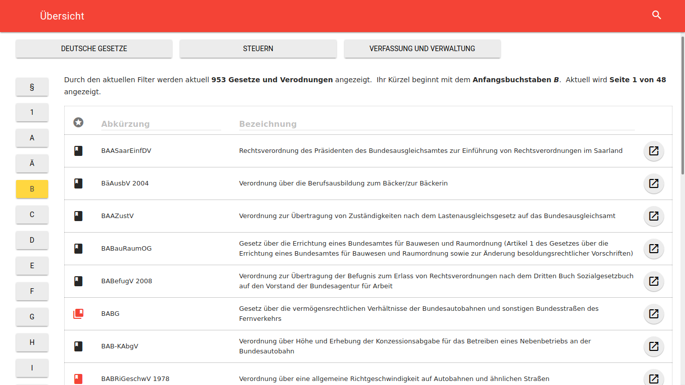

## Client Architektur {#sec:client-architecture}
Ähnlich dem Abschnitt @sec:server-architecture setzt auch die Client Applikation im Sinne einer besseren Übersichtlichkeit und Testbarkeit auf stark modularen Code. Da eine komplette Analyse des Applikationsquelltextes bei rund 6000 Zeilen Code den Rahmen dieser Arbeit sprengen würde, wird im folgenden beispielhaft anhand der Gesetzesübersicht die konkrete Implementation erläutert (Abschnitt @sec:lawindex). Außerdem werden aufgrund ihrer für die Zielsetzung besonderen Relevanz die Umsetzung der Offline-Funktionalität (Abschnitt @sec:offline) und der lokalen Suchfunktion (Abschnitt @sec:localsearch) besprochen. Da das Ziel der Implementation ein nicht nur theoretisch, sondern auch praktisch an Browser auslieferbares Paket ist, wird zum Abschluss auf den umgesetzten Buildprozess eingegangen (Abschnitt @sec:deployment).

### Gesetzesübersicht {#sec:lawindex}
Im Folgenden wird, beispielhaft für die Gesamtarchitektur, detailliert die Implementation der Gesetzesübersicht, siehe Abbildung @fig:lawindex[^lawindex_url], behandelt. Diese listet die Gesetze auf, bietet die Möglichkeit über die Buch-Icons links in der Tabelle Gesetze zu speichern und über die Action-Buttons rechts die Individualansichten aufzurufen. Zusätzlich können verschiedene Filter angewendet werden: oben kann aus einer (noch zu erweiternden) Liste von vordefinierten Sammlungen gewählt und über die Schalter links nur Gesetze mit einem bestimmten Kürzel-Anfangsbuchstaben angezeigt werden. Mit den drei Tabellenkopfspalten können außerdem respektive von links nach rechts nur markierte Gesetze oder nur solche mit einem bestimmten Bestandteil in Kürzel oder Bezeichnung angezeigt werden. Damit der Nutzer trotz der vielen Optionen den Durchblick behält werden direkt über der Tabelle die angewendeten Filter und deren Ergebnismenge knapp in natürlicher Sprache zusammengefasst.

[^lawindex_url]: [web.lawly.de/gesetze](https://web.lawly.de/gesetze)

{#fig:lawindex .shadow caption="Gesetzesübersicht (Desktop)"}

Die für diese Darstellung entwickelten Redux-Module und React-Komponenten werden als Vererbungshierarchie in Abbildung @lst:lawindex_graph dargestellt -- zusätzlich verwendete Elemente wie das übergeordnete Layout oder Komponenten aus anderen Bibliotheken wurden dabei ausgelassen.

Listing: Modulhierarchie Gesetzesübersicht

~~~{#lst:lawindex_graph .dot}
digraph G {
  node [shape=rect]
  store [shape=square]
  lawIndexModule [shape=oval]
  userModule [shape=oval]
  store -> {lawIndexModule userModule}

  // moduleX [label="..." style=dashed]
  // store -> moduleX [style=dashed]
  // containerX [label="..." style=dashed]
  // lawIndexModule -> containerX [style=dashed]
  // userModule -> containerX [style=dashed]

  LawIndexContainer [style=filled fillcolor=lightgray]
  lawIndexModule -> LawIndexContainer
  userModule -> LawIndexContainer
  LawIndexContainer -> LawIndex

  LawIndex -> {LawInitialChooser LawCollectionChooser LawIndexLead LawList}
  {rank=same; LawInitialChooser LawCollectionChooser LawIndexLead LawList}
  LawList -> {Pagination DataTable}
}
~~~

Die Gesetzesübersicht benötigt die Daten aus zwei *Redux-Modulen*: dem `lawIndexModule`[^lawindexmodule] und dem `userModule`[^usermodule]. Redux-Module sind dabei eine Zusammenfassung von für das Arbeiten mit einem bestimmten Teil des Zustandes nötigen Funktionalitäten. Dies sind einerseits Selektoren, zum strukturierten Lesen, und anderseits Action Creators, zum Eintragen und Manipulieren von Daten (siehe Abschnitt @sec:dataflow). Durch die Zentralisierung dieser Bestandteile wird eine einheitliche Interaktion mit dem Zustand garantiert.

Im Mittelpunkt zwischen Redux-Modulen und React-Komponenten steht der
`LawIndexContainer`[^lawindexcontainer], in der Abbildung ausgefüllt dargestellt. Obwohl in der Implementation eigentlich selbst eine Komponente, dient er als Schnittstelle zur Abstraktion der Verbindung. Die ihm untergeordneten Komponenten können so vollständig ohne Wissen über die Herkunft ihrer Daten verwendet und dementsprechend einfach getestet werden.

Die Gesetze erhält der Container durch die `lawIndexModule`-Selektoren. Da der Zustand aber zentralisiert ist, filtert der Container diese nicht selbst. Stattdessen werden über die Action Creators die vom Nutzer angewendeten Filter in den Zustand geschrieben, welcher dann durch die Hierarchie propagiert wird. Dabei werden auch die Selektoren von der Neuerung benachrichtigt und filtern den Index neu.

Die Selektoren gestalten komplexe Transformationen durch die Verkettung von reinen (nebeneffektfreien) Funktionen einfach und mithilfe von Memorisierung der in der Kette entstehenden Zwischenergebnissen effizient. Dies wird in Listing @lst:lawsByFilter dargestellt: Bei der Auswahl des Anfangsbuchstaben *B* (Abbildung @fig:lawindex) muss so das Ergebnis des `getLawsByCollection`-Selektors[^getlawsbycollection] nicht neu berechnet werden, da seine Eingabewerte sich nicht verändert haben. In der Kette weiter hinten angesetzte Selektoren, wie beispielsweise die für die aktuell angezeigte Seite (Seitenschalter nicht im Bild), werden, da sich ihre Eingabe geändert hat, automatisch neu berechnet. Der Container erhält so nur das bereits endgültig gefilterte Ergebnis und reicht es an die ihm untergeordneten Komponenten weiter. Die dargestellte Selektorenkette ist dabei nur ein Ausschnitt der eigentlich in der Applikation eingesetzten.[^lawindexmodule]

Listing: Ausschnitt der Gesetzesübersicht-Selektoren

~~~{#lst:lawsByFilter .javascript}
import { createSelector } from 'reselect';
const getLawIndex = state => state.get('law_index');
const getCollection = state => state.get('collection');
const getInitial = state => state.get('initial');
const getLawsByCollection = createSelector(
  [getLawIndex, getCollection],
  (laws, collection) => laws.filter(/*[...]*/)
);
const getLawsByInitial = createSelector(
  [getLawsByCollection, getInitial],
  (laws, initial) => laws.filter(law =>
    law.get('groupkey')[0].toLowerCase() === initial
  )
);
export const getLawsByPage = createSelector(/*[...]*/);
~~~

Die direkt unter dem `LawIndexContainer` angeordnete Komponente ist `LawIndex`.[^lawindex] Diese ist zentral nur für die Weiterverteilung der ihr übergebenen Attribute und die visuelle Aufteilung der Ansicht zuständig.

Bei einem Blick auf Listing @lst:LawIndex fällt auf, das für die Umsetzung der Komponentenhierarchie kein reines JavaScript, sondern *JSX* eingesetzt wird. JSX orientiert sich an der von \acsu{HTML} bekannten Struktur, welche durch ihre hierarchische Natur für die Darstellung dieses Konzeptes sehr gut geeignet ist. Obwohl es auch möglich ist, React ohne diese rein visuelle Vereinfachung zu nutzen, wird so viel unnötiger Code gespart und Übersichtlichkeit gewonnen. Außerdem wird in diesem Listing die Einfachheit des angewendeten funktionellen Ansatzes klar: Reine Komponenten sind nur eine direkte Abbildung ihrer Eingabe zu einer Darstellung. React kümmert sich hierbei wieder um die Effizienz. Ähnlich wie bei den zuvor beschrieben Selektoren wird eine solche Abbildung nur erneut berechnet, wenn sich ihre Eingabe verändert hat -- durch den Einsatz von in Abschnitt @sec:immutable beschriebenen unveränderbaren Datenstrukturen ist dieser Vergleich besonders effizient umsetzbar.

Listing: Vereinfachte `LawIndex` Komponente

~~~{#lst:LawIndex .javascript}
import { Grid, Cell } from 'react-mdl';
export const LawIndex = ({
  initials, selectInitial, selectedInitial, /* [...] */
}) => (
  <Grid>
    <Cell>
      <LawCollectionChooser {/* [...] */} />
    </Cell>
    <Cell>
      <LawInitialChooser
        initials={initials}
        selected={selectedInitial}
        onSelect={selectInitial}
      />
    </Cell>
    <Cell>
      <LawIndexLead {/* [...] */} />
      <LawList {/* [...] */} />
    </Cell>
  </Grid>
);
~~~

Erst in der ihr untergeordneten Ebene wird mit den Daten im eigentlichen Sinne gearbeitet. Wieder beispielhaft zeigt dafür Listing @lst:LawInitialChooser die Komponente zur Darstellung der Initialen-Auswahl: diese bildet, wiederum als reine Funktion, die übergebene Liste von Anfangsbuchstaben auf die einzelnen Schalter ab. Per `onClick`-Handler wird das Initial eines Schalters über die auch durch die Hierarchie vererbte `onSelect`-Funktion an den Store gesendet und durch die Propagierung des aktualisierten Zustandes der Schalter dessen `initial` mit dem `selected` Wert übereinstimmt farbig dargestellt.

Listing: Vereinfachte `LawInitialChooser` Komponente

~~~{#lst:LawInitialChooser .javascript}
import { Grid, Cell, Button } from 'react-mdl';
export const LawInitialChooser = ({
  initials, selected, onSelect
}) => (
  <Grid>
    {initials.map(initial => (
      <Cell>
        <Button
          colored={initial === selected}
          onClick={() => onSelect(initial)}
        >
          {initial}
        </Button>
      </Cell>
    ))}
  </Grid>
);
~~~

Obwohl die `LawInitialChooser`-Komponente ein Blattknoten des Graphen aus Abbildung @lst:lawindex_graph ist, vererbt sie selbst weiter an importierte Komponenten aus der `react-mdl` Bibliothek. Diese Bibliothek ist eine Implementierung von Googles Material Design Guidelines auf Grundlage von \acs{HTML}-Elementen wie `div` oder `button`. An dieser Stelle ist es allerdings auch denkbar, dass statt \acs{HTML}-Elementen native Android- oder iOS-Elemente eingesetzt werden -- der hier implementierte Code ist von der in der nächsten Ebene der Hierarchie eingesetzten Architektur unabhängig. Einem späteren Austausch der `react-mdl`-Komponenten durch native Komponenten für eine native Umsetzung einer Applikation mit ähnlicher Funktionalität steht also nichts im Wege.

[^getlawsbycollection]: [lawly_web: /src/modules/law_index.js#L135-L142](https://github.com/ahoereth/lawly_web/blob/bsc/src/modules/law_index.js#L135-L142)

[^lawindexmodule]: [lawly_web: /src/modules/law_index.js#L96ff](https://github.com/ahoereth/lawly_web/blob/bsc/src/modules/law_index.js#L96)

[^usermodule]: [lawly_web: /src/modules/user.js](https://github.com/ahoereth/lawly_web/blob/bsc/src/modules/user.js)

[^lawindexcontainer]: [lawly_web: /src/containers/LawIndexContainer.js](https://github.com/ahoereth/lawly_web/blob/bsc/src/containers/LawIndexContainer.js)

[^lawindex]: [lawly_web: /src/components/laws/LawIndex.js](https://github.com/ahoereth/lawly_web/blob/bsc/src/components/laws/LawIndex.js)

### Offline-Funktionalität {#sec:offline}

<!-- TODO: Create wrapfigure pandoc filter. -->
\begin{wrapfigure}{r}[0pt]{0.45\textwidth}
  \tikz\node[blur shadow={shadow blur steps=5}, style={inner sep=0, outer sep=0}]{
    \includegraphics[width=0.45\textwidth, frame, right]{assets/newversion}
  };
  \caption{Aktualisierung (Smartphone, vertikal)}
  \label{fig:newversion}
\end{wrapfigure}

Wie zuvor dargelegt, ist die Funktionalität der Applikation auch ohne Internetverbindung zu gewährleisten. Um dies zu erreichen werden mehrere Aspekte umgesetzt. Vergleiche hierzu auch den Abschnitt @sec:offline-first.

Einerseits wird beim Bundling der Applikation (siehe Abschnitt @sec:bundler) ein Cache Manifest erstellt, welches Informationen über die vom *Application Cache* (siehe Abschnitt @sec:offline-first) vorzuhaltenden Dateien beinhaltet. Sobald diese einmal geladen wurden, werden alle zukünftigen Anfragen aus dem Cache beantwortet und der Server nur nach einem geänderten Manifest befragt. Ändert sich das Manifest, wird der Cache im Hintergrund und die Webseite entweder durch Neuladen (beispielsweise als Reaktion auf die in Abbildung @fig:newversion dargestellte Benachrichtigung) oder beim nächsten Aufruf aktualisiert.

Anderseits gilt es, Anfragen an den \ac{API}-Server zumindest teilweise optional zu gestalten. Um dies zu erreichen wurde die `ApiClient`-Klasse[^apiclient] entwickelt, welche für alle Anfragen an den Server und auch die lokale Suche (mehr dazu in Abschnitt @sec:localsearch) zuständig ist. Innerhalb der Applikationen werden zur einfacheren Handhabung API-Anfragen als serialisierbare Objekte dargestellt (siehe Listing @lst:serializablerequests). Diese Objekte werden von der `ApiClient`-Klasse je nach beinhalteter Attribute unterschiedlich gehandhabt.

Ist eine Anfrage zum Beispiel `cachable`, so wird zuerst der lokale Key/Value-Store angefragt -- in diesem dienen diese Request-Objekte als Schlüssel. Liefert der lokale Store ein Ergebnis, wird mit diesem unmittelbar, falls spezifiziert, die Redux-Aktion (`action`-Attribut) ausgeführt. Daraufhin wird getestet ob für diesen Cache-Wert ein Ablaufdatum gesetzt ist und ob dieses überschritten wurde -- wenn letzteres gilt oder überhaupt kein Ablaufdatum vorhanden ist, wird die Anfrage an den Server gestellt, der Cache bei erhalten einer Antwort aktualisiert und gegebenenfalls erneut die Redux-Aktion mit den aktualisierten Werten aufgerufen. Durch die Verwendung eines mit Ablaufsdatum versehenen Caches wird nicht nur die Interaktion des Nutzers mit der Webseite beschleunigt, sondern auch die Belastung des Servers durch weniger Anfragen reduziert. ^[>\color{red}Watch out for this to not overlap the figure.]

Listing: Serialisierbares API-Request Objekt

~~~{#lst:serializablerequests .javascript}
const urhgRequest = {
  method: 'get', cachable: true,
  name: 'laws', groupkey: 'urhg',
  action: FETCH_SINGLE
};
~~~

Um auch bei nicht zwischenspeicherbaren Anfragen wie beispielsweise dem Vormerken von Gesetzen eine fließende Nutzererfahrung zu bieten, können Anfragen simuliert werden. Dafür wird das gewissermaßen vorhergesagte Ergebnis als *payload*-Attribut an das lokale Request-Objekt angehangen womit daraufhin die Redux-Aktion auch ohne vorhandenen Cache unmittelbar ausgelöst werden kann.

[^apiclient]: [lawly_web: /src/helpers/ApiClient.js](https://github.com/ahoereth/lawly_web/blob/bsc/src/helpers/ApiClient.js)

[^canicache]: http://caniuse.com/#feat=offline-apps

### Lokale Volltextsuche {#sec:localsearch}
Als ein Teil der zentralen Funktionalität der Applikation gilt es auch die Volltextsuche ohne Internetverbindung zur Verfügung zu stellen. Das Problem hierbei: Volltextsuche ist auf nicht dafür spezialisierten Systemen sehr rechenintensiv.

Für die Gesetzesübersicht, beschrieben im vorhergehenden Abschnitt, wird das Filtern durch die Anwendung von regulären Ausdrücken in einer Schleife über die Gesetze realisiert. Da die Zahl der Gesetze nur bei ungefähr $7.000$ liegt und nur nach Kürzel und Bezeichnung gefiltert wird, ist dies noch durch die zuvor beschriebene Memorisierung performant umsetzbar. Bei der Volltextsuche gilt es allerdings auch die individuellen Normen und insbesondere deren Textkörper zu durchsuchen. Hierbei wächst die Datenmenge mit der Nutzung der Applikation durch den individuellen Nutzer -- speichert er mehr Gesetze für die offline Verwendung ab, gilt es auch mehr Gesetze zu durchsuchen.

{#fig:search .shadow caption="Volltextsuche (Smartphone, horizontal)"}

Anders als bei anderen Teilen der Applikation wird hierbei standardmäßig nicht auf die lokale Implementation gesetzt, solange eine Internetverbindung verfügbar ist. Stattdessen wird, um umfassende Ergebnisse über den gesamten Corpus von ca. 113.000 Normen zu liefern, die Suche durch die serverseitige PostgreSQL Datenbank bevorzugt.

Falls der \ac{API}-Server nicht verfügbar ist, wird lokal gesucht. Hierbei hat sich als sehr problematisch erwiesen, dass Webseiten nur in einem einzelnen Prozess ausgeführt wird. Blockiert also das JavaScript durch sequentielle Operationen diesen Prozess, ist auch die dargestellte Webseite nicht reaktionsfähig. So wäre es zum Beispiel während einer Suche nicht möglich die Suchanfrage im Eingabefeld zu verfeinern. Zusätzlich ist nicht nur die eigentliche Suche sondern auch das erstellen des notwendigen Suchindexes sehr rechenintensiv und würde, wenn im gleichen Prozess ausgeführt, das Starten der Applikation massiv verlangsamen. Um dies zu umgehen wird ein *Web Worker* eingesetzt.

Web Worker sind eine in neueren Browsern[^caniwebwork] zur Verfügung gestellte Funktionalität zum Auslagern von JavaScript-Operationen in einen gesonderten Prozess. Dabei wird zwischen dem Hauptprozess und dem Web Worker ähnlich wie auf Serverseite beim Eintreffen von Anfragen über Ereignisse kommuniziert. Um dies auf Clientseite zu abstrahieren wurden zwei Klassen entwickelt: `LocalSearch`[^localsearch] und `LocalSearchWorker`[^localsearchworker]. Erstere wird von der zentralen \ac{API}-Abstraktion (siehe Abschnitt @sec:offline-first) auf ähnliche Weise wie der \ac{API}-Server angesprochen und Antworten asynchron verarbeitet. Die `LocalSearch`-Klasse überträgt Anfragen zusammen mit einem eindeutigen Hash an die in ihrem individuellen Prozess ausgeführte `LocalSearchWorker`-Klasse und lauscht auf das durch den Hash identifizierbare Ergebnis auf diese konkrete Anfrage.

[^caniwebwork]: http://caniuse.com/#search=webworker

[^localsearch]: [lawly_web: /src/helpers/LocalSearch.js](https://github.com/ahoereth/lawly_web/blob/bsc/src/helpers/LocalSearch.js)

[^localsearchworker]: [lawly_web: /src/helpers/LocalSearchWorker.js](https://github.com/ahoereth/lawly_web/blob/bsc/src/helpers/LocalSearchWorker.js)

### Transpilierung & Bündlung {#sec:bundler}
Wie in Abschnitt @sec:javascript beschrieben werden bei der Entwicklung der Applikation moderne noch nicht in allen gängigen Browsern verfügbare JavaScript-Funktionalitäten eingesetzt. Um trotzdem eine möglichst große Bandbreite an Browsern zu unterstützen wird der Code zu einer älteren Version der Sprache übersetzt. Dieser Vorgang, moderne Sprachfeatures durch ältere, breiter etablierte, auszudrücken, nennt sich Transpilierung. Zusätzlich ist es von Interesse den benötigten Quelltext in einer Einzeldatei zu bündeln, um beim initialen Seitenaufruf möglichst wenige HTTP-Anfragen durchführen zu müssen. Bei jeder HTTP-Anfrage kommt es zu Wartezeiten zwischen Anfrage und Beginn des Antworterhalts, so dass das Übertragen von vielen Einzeldateien mehr Zeit in Anspruch nimmt als die Übertragung eines einzelnen größeren Pakets. Um die Ladezeit weiter zu verringern ist es wichtig, nur Code in das endgültige Paket zu übernehmen, welcher auch aktiv Verwendung findet. Dies ist besonders beim einsetzen externer Bibliotheken nicht trivial, da diese oft unübersichtlich verschachtelt sind. Durch den Einsatz von JavaScript-Modulen ist es möglich von einem Einstiegspunkt aus den Modulbaum zu traversieren und durch sogenanntes *tree-shaking* nur wirklich genutzten Code aus jedem Modul in das endgültige Paket zu übernehmen [@Harris2015].

Um diese Schritte im Entwicklungsprozess zu automatisieren wird *Webpack* eingesetzt: Webpack traversiert von einem Einstiegspunkt aus den Modulbaum, lädt die einzelnen Module mit Hilfe von verschiedenen Erweiterungen und kümmert sich um das Abtrennen von ungenutztem Code. Eine der Erweiterungen ist beispielsweise *Babel*, welches für die Transpilierung zuständig ist. Andere solche Erweiterungen sind für das Laden von in bestimmten Komponenten eingebundene \ac{CSS}-Styles, Schriftarten oder Bilder zuständig.
